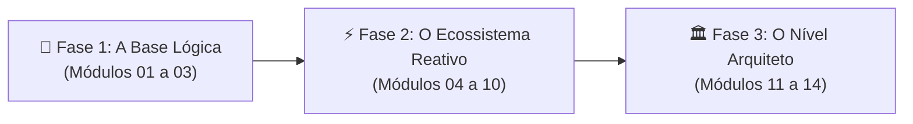

# 🏛️ Do Algoritmo ao Arquiteto
### A Formação Definitiva em Engenharia Frontend com Angular

[](https://angular.dev)
[](https://www.typescriptlang.org/)
[](https://vitest.dev)
[](https://angular.dev)
[](#)

> **"Não seja apenas um colador de componentes. Torne-se um Engenheiro Frontend completo dominando da base lógica à arquitetura corporativa."**

Este projeto é uma **formação prática de ponta a ponta** estruturada para transformar desenvolvedores em engenheiros de software frontend de alto calibre. Utilizando o ecossistema moderno do **Angular** como motor principal, o projeto cobre desde os alicerces fundamentais da ciência da computação até padrões arquiteturais corporativos, reatividade com Signals e otimização de performance.

---

## 🧭 As Três Fases da Formação



1. **🧠 Fase 1: A Base Lógica (O Algoritmo)**  
   *Estruturas de dados (pilha, fila, listas), algoritmos de ordenação e busca, tipagem avançada em TypeScript e fundamentos do framework.*
2. **⚡ Fase 2: O Ecossistema Reativo (O Framework Moderno)**  
   *Componentes com ciclo de vida, diretivas customizadas, DI com `inject()`, HTTP com retry/fallback, Reactive Forms, Guards de rota, RxJS e State Management com Signals.*
3. **🏛️ Fase 3: O Nível Arquiteto (Engenharia & Produção)**  
   *Testes automatizados com Vitest & TestBed, otimização de renderização (`ChangeDetectionStrategy.OnPush`, `@defer`), princípios SOLID, Design Patterns e uma aplicação completa no Projeto Integrador.*

---

## 📚 Grade Curricular dos 14 Módulos

| Módulo | Tema | Destaques Práticos Implementados |
| :--- | :--- | :--- |
| **01** | **Algoritmos e Estruturas de Dados** | Pilhas, Filas, Listas Encadeadas, Algoritmos de Busca (Linear, Binária) e Ordenação (Bubble, Quick, Merge) com simulador interativo em tempo real. |
| **02** | **TypeScript e POO Avançada** | Generics, Mapped Types, Conditional Types, Utility Types e POO com classes abstratas, interfaces e modificadores de acesso. |
| **03** | **Fundamentos do Angular Moderno** | Template syntax moderna, Data Binding bidirecional, ciclo de vida de componentes (`ngOnInit`, `ngAfterViewInit`, `ngOnDestroy`). |
| **04** | **Componentes e Diretivas Avançadas** | Diretiva customizada `appHighlight`, `@Input`/`@Output`, projeção com `<ng-content>` e monitor de renderização de componentes filhos. |
| **05** | **Services e Injeção de Dependências** | Injeção moderna com a função `inject()`, escopos `@Injectable({ providedIn: 'root' })` e gerenciamento de estado reativo isolado. |
| **06** | **HTTP Client e Integração de APIs** | Operações CRUD completas (GET, POST, PUT, DELETE) com `provideHttpClient(withFetch())`, resiliência com `retry()`, tratamento de erros com `catchError()` e fallback mock. |
| **07** | **Formulários Reativos Avançados** | `FormGroup`, arrays dinâmicos com `FormArray` para habilidades/tags, e validadores customizados síncronos (validação cruzada de senhas). |
| **08** | **Roteamento Avançado e Navegação** | Parâmetros de rota (`:id`), Query Params, simulador interativo de Guards funcionais (`CanActivateFn` e `CanDeactivateFn`). |
| **09** | **Programação Reativa com RxJS** | Fluxos reativos com `debounceTime`, `distinctUntilChanged`, `switchMap`, `BehaviorSubject` e visualizador gráfico de streams de mármore. |
| **10** | **State Management com Signals** | Gerenciamento de estado nativo com `signal()`, `computed()` e `effect()`, implementando uma mini-store de carrinho de compras reativo sem boilerplate. |
| **11** | **Testes Unitários e de Integração** | Suíte de testes com Vitest e Angular `TestBed`, spies, mocks e simulador interativo de pipeline de testes automatizados. |
| **12** | **Performance e Otimização** | `ChangeDetectionStrategy.OnPush`, blocos de renderização diferida `@defer (on interaction; prefetch on hover)` com `@placeholder` e `@loading`. |
| **13** | **Design Patterns e SOLID** | Padrão comportamental Strategy (gateways de pagamento), os 5 princípios SOLID explicados com contraexemplos e arquitetura limpa em camadas. |
| **14** | **Projeto Final Integrador (DevLearn Pro)** | Plataforma completa de cursos unindo Signals, formulários reativos com modais, KPIs em tempo real, filtros dinâmicos e sistema de toasts. |

---

## 🚀 Como Executar Localmente

### Pré-requisitos
- **Node.js** v18+ ou v20+
- **npm** v9+

### Passo a Passo

```bash
# 1. Clone o repositório
git clone https://github.com/alexnfeitozad/do-algoritmo-ao-arquiteto-angular.git

# 2. Acesse a pasta do projeto
cd do-algoritmo-ao-arquiteto-angular

# 3. Instale as dependências
npm install

# 4. Inicie o servidor de desenvolvimento
npm start
```

Acesse em seu navegador: **`http://localhost:4200/`**

---

## 🧪 Testes e Qualidade de Código

O projeto conta com suíte de testes unitários automatizada com **Vitest**:

```bash
# Executar todos os testes unitários (modo single-run)
npm test -- --no-watch

# Executar testes em modo watch (desenvolvimento)
npm test
```

### Compilação de Produção
Para verificar a integridade da tipagem, templates e otimização dos chunks lazy:

```bash
npm run build
```

---

## 📁 Estrutura Arquitetural

```
src/
├── app/
│   ├── modulo-01-algoritmos/          # Algoritmos e Estruturas de Dados
│   ├── modulo-02-typescript/          # Tipagem Estrita e POO
│   ├── modulo-03-fundamentos-angular/ # Data Binding e Lifecycle
│   ├── modulo-04-componentes-diretivas# @Input, @Output, Diretivas
│   ├── modulo-05-services-di/         # Injeção e Estado Isolado
│   ├── modulo-06-http-apis/           # CRUD, Retry, Fallback Mock
│   ├── modulo-07-reactive-forms/      # FormArray e Validadores Custom
│   ├── modulo-08-routing/             # Guards, Query & Route Params
│   ├── modulo-09-rxjs/                # Operadores e Stream Monitor
│   ├── modulo-10-state-management/    # Angular Signals (signal, computed)
│   ├── modulo-11-testing/             # Vitest e TestBed
│   ├── modulo-12-performance/         # OnPush e @defer
│   ├── modulo-13-patterns/            # Strategy, SOLID e Clean Arch
│   └── modulo-14-projeto-final/       # DevLearn Pro (Portal Integrador)
├── styles.scss                        # Design System Dark/Glassmorphic
└── index.html                         # Typography & Meta SEO
```

---

## 👨‍💻 Autor & Mentor

Desenvolvido por **Alex N. Feitoza**  
- **GitHub:** [@alexnfeitozad](https://github.com/alexnfeitozad)
- **Repositório:** [do-algoritmo-ao-arquiteto-angular](https://github.com/alexnfeitozad/do-algoritmo-ao-arquiteto-angular)

---
*Transformando estudantes em Engenheiros Frontend completos.*